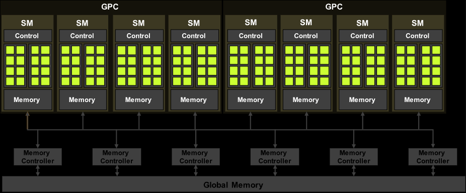

## 4.1 Architecture of a Modern GPU



- The GPU is organised into an array of highly threaded **Streaming Multiprocessors** (**SM**s).
- Each SM has several processing units called **streaming processors**.
	- These share control logic and memory resources.
- Starting with the Hopper architecture, the SMs of a GPU are grouped into **GPU Processing Clusters** (**GPC**s).

- The memory resources of SMs consist of different on-chip memory structures.
- GPUs come with gigabytes of off-chip device memory, referred to as **global memory**.
	- This memory is accessed through multiple memory controllers or memory channels.

- Older GPUs used **GDDR** (**Graphics Double Data Rate**) **SDRAM** (**Synchronous Dynamic Random Access Memory**).
- GPUs starting with Pascal architecture may use **HBM** (**High-Bandwidth Memory**), HBM2, HMB2E or HBM3.
	- These consist of DRAM modules tightly integrated with the GPU in the same package.


## 4.2 Thread Block Scheduling

- A grid of threads can easily outnumber the available GPU execution resources.
- A thread block scheduling mechanism is needed to assign threads to execution resources as the resources become available.
- In CUDA, threads are assigned to SMs on a block by block basis.
	- I.e. all threads in a block are simultaneously assigned to the same SM.
- Multiple blocks can be simultaneously assigned to the same SM as permitted by the available SM resources.
	- However, blocks need to reserve hardware resources to execute, so only a limited number of blocks can be simultaneously assigned to a given SM.
		- This limit is discussed in section 4.6.

- All in all, there are limited SMs and limited numbers of blocks that can be simultaneously assigned to each SM.
	- However, grids usually contain many more blocks than this number.
- To ensure that all blocks in a grid get executed, the run-time system maintains a list of blocks that need to execute.
	- It also assigns new blocks to SMs when previously assigned block complete execution.

- With Hopper architecture, CUDA introduced an optonal hierarchy level called **thread block cluster**.
	- This is a group of thread blocks.
- Similar to threads in the same block being assigned onto the same SM, blocks in the same thread block cluster are co-scheduled onto the same GPC.
	- Threads in the same cluster can synchronise via the corresponding API (section 4.3).
	- They also have access to **distributed shared memory**, which is composed of the shared memory of all blocks participating in a thread block cluster.


## 4.3 Synchronisation and Transparent Scalability

- CUDA allows threads in the same block to coordinate using the block-wide barrier synchronisation function `__syncthreads()`.
	- `__` is the convention for indicating intrinsic functions in CUDA.
- When a thread calls `__syncthreads()`, it will be held at the program location of the call until every threads in the same block reaches that location.

> Intrinsic Functions
> Modern processors often offer special instructions that either perform critical functionality or substantial performance enhancement. These instructions are typically exposed to the programmers as *intrinsic functions*, or simply *intrinsics*. From the programmer’s perspective, these are library functions. However, they are treated in a special way by compilers; each such call is translated into the corresponding special instruction. There is typically no function call in the final code, just the special instructions in line with the user code. All major modern compilers, such as the GNU Compiler Collection (gcc), Intel C Compiler, and Clang/LLVM C Compiler support intrinsics.

[Programming Massively Parallel Processors 5th Edition, page 70](Programming%20Massively%20Parallel%20Processors%205th%20Edition.pdf#page=100&selection=466,1,665,10)

- At the thread block cluster level, cluster-wise synchronisation can be utilised using the **Cooperative Groups API**.
- The collection of threads involved in a barrier is called the **scope** of the barrier.
- At the grid-level, threads across the entire grid can perform a grid-wide barrier synchronisation, also through the Cooperative Groups API.
	- However, this is more heavyweight than the block-wide and cluster-wide ones.
	- There are also several important restrictions that must be obeyed to ensure that all threads in the grid are simultaneously executing and can reach the barrier.


```cpp
void incorrect_barrier_example(int n) {
	...
	if (threadIdx.x % 2 == 0) {
		...
		__syncthreads();
	} else {
		...
		__syncthreads();	
	}
}
```

- The `__syncthread` calls define two different barriers.
	- This will result in undefined behaviour.
- In general, correct usage of barriers can result in incorrect results or in threads waiting for each other forever.
	- This is known as a **deadlock**.

- Not only do all threads in a block have to be assigned to the same SM, they also need to be assigned to that SM simultaneously.
	- I.e. a block can only begin execution when the run-time system has secured all the resources needed by all threads.
	- This ensures that the time proximity of all threads in a block and prevents excessive or even indefinite waiting time during barrier synchronisation.
- A group of thread blocks executing simultaneously is usually referred to as a **wave**.
	- The ratio of the total number of thread blocks in the grid to the number that can execute simultaneously is referred to the number of waves.
- It is desirable to have a large number of waves when the load across blocks is imbalanced.
	- This provides more opportunities for the hardware to balance the load across SMs.
- It is acceptable and sometimes better to have smaller numbers of waves when the load across blocks is balanced.
	- This is discussed in chapter 6 under thread coarsening.

- If using a small number of waves, care must be taken to avoid situations where the last wave is not complete.
	- I.e. It consists of only a small number of blocks and thus does not fully utilise the hardware.
	- This is called a **tail effect**.
	- For example, if a grid has 660 block runs and the GPU can execute 264 blocks simultaneously, it will have 660/264 = 2.5 waves.
		- If the blocks are balanced, then the first wave will execute, followed by the second wave. The last wave will only have 132 blocks.
		- This under utilises GPU resources.
- To avoid tail effects, it is desirable to configure grids with a number of blocks that is a multiple of the number that can run simultaneously.
	- I.e. an integer number of waves.
	- This number depends on the amount of hardware resources available in the GPU.

- The ability to execute the same application code on different hardware with different amounts of execution resources is refereed to as **transparent scalability**.
