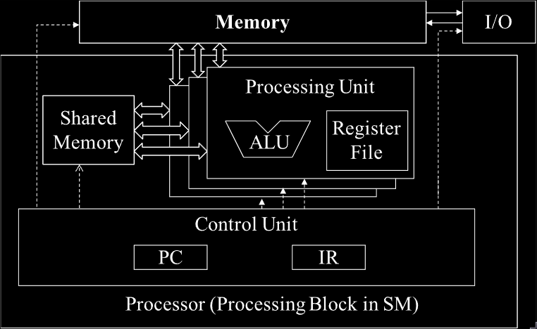

## 4.1 Architecture of a Modern GPU


- The GPU is organised into an array of highly threaded **Streaming Multiprocessors** (**SM**s).
- Each SM has several processing units called **streaming processors**.
	- These share control logic and memory resources.
- Starting with the Hopper architecture, the SMs of a GPU are grouped into **GPU Processing Clusters** (**GPC**s).

- The memory resources of SMs consist of different on-chip memory structures.
- GPUs come with gigabytes of off-chip device memory, referred to as **global memory**.
	- This memory is accessed through multiple memory controllers or memory channels.

- Older GPUs used **GDDR** (**Graphics Double Data Rate**) **SDRAM** (**Synchronous Dynamic Random Access Memory**).
- GPUs starting with Pascal architecture may use **HBM** (**High-Bandwidth Memory**), HBM2, HMB2E or HBM3.
	- These consist of DRAM modules tightly integrated with the GPU in the same package.


## 4.2 Thread Block Scheduling

- A grid of threads can easily outnumber the available GPU execution resources.
- A thread block scheduling mechanism is needed to assign threads to execution resources as the resources become available.
- In CUDA, threads are assigned to SMs on a block by block basis.
	- I.e. all threads in a block are simultaneously assigned to the same SM.
- Multiple blocks can be simultaneously assigned to the same SM as permitted by the available SM resources.
	- However, blocks need to reserve hardware resources to execute, so only a limited number of blocks can be simultaneously assigned to a given SM.
		- This limit is discussed in section 4.6.

- All in all, there are limited SMs and limited numbers of blocks that can be simultaneously assigned to each SM.
	- However, grids usually contain many more blocks than this number.
- To ensure that all blocks in a grid get executed, the run-time system maintains a list of blocks that need to execute.
	- It also assigns new blocks to SMs when previously assigned block complete execution.

- With Hopper architecture, CUDA introduced an optonal hierarchy level called **thread block cluster**.
	- This is a group of thread blocks.
- Similar to threads in the same block being assigned onto the same SM, blocks in the same thread block cluster are co-scheduled onto the same GPC.
	- Threads in the same cluster can synchronise via the corresponding API (section 4.3).
	- They also have access to **distributed shared memory**, which is composed of the shared memory of all blocks participating in a thread block cluster.


## 4.3 Synchronisation and Transparent Scalability

- CUDA allows threads in the same block to coordinate using the block-wide barrier synchronisation function `__syncthreads()`.
	- `__` is the convention for indicating intrinsic functions in CUDA.
- When a thread calls `__syncthreads()`, it will be held at the program location of the call until every threads in the same block reaches that location.

> Intrinsic Functions
> Modern processors often offer special instructions that either perform critical functionality or substantial performance enhancement. These instructions are typically exposed to the programmers as *intrinsic functions*, or simply *intrinsics*. From the programmer’s perspective, these are library functions. However, they are treated in a special way by compilers; each such call is translated into the corresponding special instruction. There is typically no function call in the final code, just the special instructions in line with the user code. All major modern compilers, such as the GNU Compiler Collection (gcc), Intel C Compiler, and Clang/LLVM C Compiler support intrinsics.

[Programming Massively Parallel Processors 5th Edition, page 70](Programming%20Massively%20Parallel%20Processors%205th%20Edition.pdf#page=100&selection=466,1,665,10)

- At the thread block cluster level, cluster-wise synchronisation can be utilised using the **Cooperative Groups API**.
- The collection of threads involved in a barrier is called the **scope** of the barrier.
- At the grid-level, threads across the entire grid can perform a grid-wide barrier synchronisation, also through the Cooperative Groups API.
	- However, this is more heavyweight than the block-wide and cluster-wide ones.
	- There are also several important restrictions that must be obeyed to ensure that all threads in the grid are simultaneously executing and can reach the barrier.


```cpp
void incorrect_barrier_example(int n) {
	...
	if (threadIdx.x % 2 == 0) {
		...
		__syncthreads();
	} else {
		...
		__syncthreads();	
	}
}
```

- The `__syncthread` calls define two different barriers.
	- This will result in undefined behaviour.
- In general, correct usage of barriers can result in incorrect results or in threads waiting for each other forever.
	- This is known as a **deadlock**.

- Not only do all threads in a block have to be assigned to the same SM, they also need to be assigned to that SM simultaneously.
	- I.e. a block can only begin execution when the run-time system has secured all the resources needed by all threads.
	- This ensures that the time proximity of all threads in a block and prevents excessive or even indefinite waiting time during barrier synchronisation.
- A group of thread blocks executing simultaneously is usually referred to as a **wave**.
	- The ratio of the total number of thread blocks in the grid to the number that can execute simultaneously is referred to the number of waves.
- It is desirable to have a large number of waves when the load across blocks is imbalanced.
	- This provides more opportunities for the hardware to balance the load across SMs.
- It is acceptable and sometimes better to have smaller numbers of waves when the load across blocks is balanced.
	- This is discussed in chapter 6 under thread coarsening.

- If using a small number of waves, care must be taken to avoid situations where the last wave is not complete.
	- I.e. It consists of only a small number of blocks and thus does not fully utilise the hardware.
	- This is called a **tail effect**.
	- For example, if a grid has 660 block runs and the GPU can execute 264 blocks simultaneously, it will have 660/264 = 2.5 waves.
		- If the blocks are balanced, then the first wave will execute, followed by the second wave. The last wave will only have 132 blocks.
		- This under utilises GPU resources.
- To avoid tail effects, it is desirable to configure grids with a number of blocks that is a multiple of the number that can run simultaneously.
	- I.e. an integer number of waves.
	- This number depends on the amount of hardware resources available in the GPU.

- The ability to execute the same application code on different hardware with different amounts of execution resources is refereed to as **transparent scalability**.


## 4.4 Warps and SIMD Hardware

- Thread scheduling in CUDA GPUs is a hardware implementation concept and thus must be discussed in the context of specific hardware implementations.
- In most implementations to date, once a block is assigned to a streaming multiprocessor, it is further divided into 32-thread units called **warps**.
	- The size of warps is implementation specific and can vary in future generations of GPUs.
- Knowledge of warps can be helpful in understanding and optimising the performance of CUDA applications on particular generations of CUDA devices.
- A **warp** is the unit of thread scheduling in SMs.
	- If each block has 256 threads, then each block has 256/32 = 8 warps.
		- With 3 blocks in the SM, there are 24 warps in the SM.

- A SM is designed to execute all threads in a warp following the **Single Instruction, Multiple Data (SIMD)** model.
	- That is, at any instant in time, one instruction is fetched and executed by all threads in the warp.
- For this purpose, an SM is organised into multiple **processing blocks** and the warps on an SM are distributed across the processing blocks.
- Threads in the same warp are assigned to the same processing block, which fetches the instruction for the warp and executes it for all threads in the warp.
	- These threads apply the same instruction to their portions of the data.
	
- Because the CUDA thread scheduling mechanism maps warps to the processing blocks and effectively restricts all threads in a warp to execute the same instruction at any point of time.
	- This execution behaviour of a warp is called **Single Instruction, Multiple Thread** (**SIMT**).
	- The advantage of SIMT is that code can be written for scalar threads, which are then later grouped into warps by the SM and transparently use the SIMD hardware.
	- This is opposed to CPU SIMD programming, where the programmer/compiler must use API functions to use the SIMD hardware within each thread.

### Warps and SIMD Hardware


- The motivation for executing threads as warps is illustrated by the above modified von Neumann model, adapted to reflect a GPU design.
- All processing units are controlled by the same instruction in the Instruction Register (IR) of the Control Unit.
	- Their execution differences are duo to the different data operand values in the register files.
	- This is called SIMD in processor design.
	- For example, although all processing units are controlled by an instruction, such as add r1, r2, r3, the contents of r2 and r3 are different in different processing units.


## 4.5 Control Divergence

- SIMD execution works well when all threads within a warp follow the same path of execution, or **control flow**, when working on their data.
- When threads within a warp take different control flow paths, the SIMD hardware will take multiple passes through theses paths, one pass for each path.

```cpp
if (threadIdx.x < 24) {
	A
} else {
	B
}
C
```

- In this example two passes would be taken.
	- Some threads in a warp follow the then-path while others follow the else path.
	- One pass executes the threads that follow the then-path and the other executes threads that follow the else-path.
- During each pass through a path, the threads that follow the other paths are not allowed to take effect.
	- I.e. the else-path must wait for the then-path to finish.
- When threads threads in the same warp follow different control flow paths, the threads are said to exhibit **control divergence**.
- The cost of divergence is the extra passes the hardware needs to take to allow different threads in a warp to make their own decisions, as well as the execution resources that are consumed by the inactive threads in each pass.

- In Pascal architecture and prior architectures, these passes are executes sequentially.
- From Volta onwards, these passes may be executed concurrently.
	- The passes may be interleaved with the execution of another.

- An important implication of independent thread scheduling is that it cannot be assumed that the threads of the warp reconverge after the divergent execution paths are executed.
	- All threads in a warp must complete a phase of their execution before any of them can move on.
	- A warp-level barrier synchronisation primitive, such as `__syncwarp()`, must be used.

- Divergence can also arise in other control flow constructs.
	- A for-loop can do this.

```cpp
N = a[threadIdx.x];
for (i = 0; i < N; ++i) {
	A
}
```

- In this example, each thread executes a different number of loop iterations.

- It can be determined if a control construct can result in thread divergence by inspecting its decision condition.
	- If the decision condition is based on `threadIdx` values, the control statement can potentially cause thread divergence.


## 4.6 Warp Scheduling and Latency Tolerance

- When threads are assigned to SMs, there are usually more threads assigned to an SM than streaming processors in the SM.
- Each SM can execute instructions for a small number of warps at any given point in time.
	- That is, each SM contains multiple processing execute instructions only for a subset of all warps assigned to the SM.

- Why have so many warps assigned to an SM if it can only execute a subset of them at any instant?
	- The answer is that this is how GPUs tolerate long-latency operations, such as globol memory accesses.
- When an instruction to be executed by a warp needs to wait for the result of a previously initiated long-latency operation, the warp is not selected for execution.
	- Instead, another resident warp that is no longer waiting for results of previous instructions will be selected for execution.
	- If more than one warp is ready for execution, a priority logic is used to select one for execution.
- The ability for each SM to select different ready warps for execution at each instant is called **fine-grained multithreading** and allows SMs to use the latency time of instructions from some threads to execute instructions from other threads.
- Fine-grained multithreaded execution of warps can achieve high utilisation of execution units in spit of long latency of instructions.
	- This is referred to as **latency tolerance** or **latency hiding**.

> Latency tolerance is needed in many everyday situations. For example, in post offices, each person trying to ship a package should ideally have filled out all the forms and labels before going to the service counter. However, as we all have experienced, some people wait for the service desk clerk to tell them which form to fill out and how to fill out the form. When there is a long line in front of the service desk, it is important to maximize the productivity of the service clerks. Letting a person fill out the form in front of the clerk while everyone waits is not a good approach. The clerk should be helping the next customers who are waiting in line while the person fills out the form. These other customers are “ready to go” and should not be blocked by the customer who needs more time to fill out a form. This is why a good clerk would politely ask the first customer to step aside to fill out the form while he/she can serve other customers. In most cases, the first customer will be served as soon as he finishes the form and the clerk finishes serving the current customer, instead of going to the end of the line. We can think of these post office customers as warps and the clerk as a hardware execution unit. The customer that needs to fill out the form corresponds to a warp whose continued execution is dependent on a long latency operation.

[[Programming Massively Parallel Processors 5th Edition.pdf#page=113&selection=551,0,1066,10|Programming Massively Parallel Processors 5th Edition, page 83]]	

- The selection of warps ready for execution does not introduce any idle or wasted time into the execution timeline.
	- This is referred to as **zero-overhead thread scheduling**.
- With warp scheduling, the long waiting time of warp instructions is "hidden" by executing instructions from other warps.
- This ability to tolerate long operation latencies is the main reason why GPUs do not dedicate nearly as much chip area to cache memories and branch prediction mechanisms as CPUs.
	- As a result, GPUs can dedicate more chip area to floating-point execution units and memory access channels.

> Threads, Context-switching, and Zero-overhead Scheduling
> 
> Based on the von Neumann model, we are ready to more deeply understand how threads are implemented. A thread in modern computers is a program and the state of executing the program on a von Neumann Processor. Recall that a thread consists of the code of a program, the instruction in the code that is being executed, and values of its variables and data structures. In a computer based on the von Neumann model, the code of the program is stored in the memory. The PC keeps track of the address of the instruction of the program that is being executed. The IR holds the instruction that is being executed. The registers and memory hold the values of the variables and data structures. Modern processors are designed to allow context-switching, where multiple threads can time-share a processor by taking turns to make progress. By carefully saving and restoring the PC value and the contents of registers and memory, we can suspend the execution of a thread and correctly resume the execution of the thread later. However, saving and restoring register contents during context-switching in these processors can incur significant overhead in terms of added execution time. Zero-overhead scheduling refers to the GPU’s ability to put a warp that needs to wait for a long-latency instruction result to sleep and activate a warp that is ready to go without introducing any extra idle cycles in the processing units. Context switching on traditional CPUs incurs such idle cycles because switching the execution from one thread to another requires saving the execution state (such as register contents of the out-going thread) to memory and loading the execution state of the incoming thread from memory. GPU SMs achieves zero-overhead scheduling by holding all the execution states for the assigned warps in the hardware registers so there is no need to save and restore states when switching from one warp to another.

[[Programming Massively Parallel Processors 5th Edition.pdf#page=114&selection=305,0,956,8|Programming Massively Parallel Processors 5th Edition, page 85]]

- For latency tolerance to be effective, it is desirable for an SM to have many more threads assigned to it than what can be simultaneously supported with its execution resources to maximise the chance of finds a warp that is ready to execute.


## 4.7 Resource Partitioning and Occupancy

- Whilst it is desirable to assign many warps to an SM to tolerate high operation latencies.
	- It may not always be possible to assign to the SM the max number of warps that the SM supports.
- The ratio of the number of warps assigned to an SM to the max number it supports is referred to as **occupancy**.

- Besides the streaming processors, the execution resources in an SM include:
	- Registers
	- Shared memory
	- Thread block slots
	- Thread slots
- These resources are dynamically partitioned across threads to support their execution.

- A H100 GPU can support a max of 32 blocks per SM, 64 warps (2048 threads) per SM and 1024 threads per block.
- If a grid is launched with a block size of 1024 threads (max allowed), the 2048 thread slots in each SM are partitioned and assigned to 2 blocks.
	- In this case, each SM can accommodate up to 2 blocks.
- Similarly, if a grid is launched with a block size of 512, 256, 128 or 64 threads, the 2048 thread slots are partitioned and assigned to 4, 8, 16 or 32 blocks respectively.
- This ability to dynamically partition thread slots among blocks makes SMs very versatile.
	- They can either execute many blocks, each having few threads or execute few blocks each having many threads.
- This is contrasts a fixed partitioning method, where each block would receive a fixed amount of resources, regardless of its real needs.
	- Fixed partitioning results in wasted thread slots, when each block demands fewer threads than the fixed partition supports and fails to support blocks that require more thread slots than that.

- Dynamic partitioning of resources can lead to subtle interactions between resource limitations, which can cause under-utilisation of resources.
	- Such interactions can occur between block slots and thread slots.
- An H100 has 32 block slots and can only accommodate 32 blocks at any point in time.
	- If in the example above 32 thread block size was chosen, 64 blocks would be required.
	- This means that only 1024 of the thread slots will be utilised.
		- I.e. 32 blocks with 32 threads each.
	- The occupancy in this case is (1024 assigned threads) / (2048 max threads) = 50%.
	- Therefore, to fully utilise the threads slots and achieve max occupancy, at least 64 threads per block are needed.

- Another situation that could negatively impact occupancy us when the number of thread slots is not divisible by the block size.
- For example, with the H100 2048 threads per SM can be supported.
	- If a block size of 768 is used, the SM will only be able to accommodate 2 thread blocks (1536 threads), leaving 512 thread slots underutilised.

- Some kernels may use many auto variables and others may use few of them.
	- It should be expected that some kernels require many registers per thread and some require few.
- By dynamically partitioning registers in an SM across threads, the SM can accommodate many blocks if they require few registers per thread and fewer blocks if they require more registers per thread.
- The programmer should be aware of the potential impact of register resource limitations on occupancy.
	- For example, the H100 GPU allows a max of 65,536 registers per SM.
	- To run at full occupancy, each SM needs enough registers for 2048 threads, which means that each thread should not use more than (64,536 registers) / (2048 threads) = 32 registers per thread.
- In some cases, the compiler may perform register spilling to reduce the register requirement per thread and thus elevate the level of occupancy.
	- Register spilling forces excess thread variables out of fast hardware registers and into slower memory to stay within a specific register limit.

- It should be clear that the constraints of all the dynamically partitioned resources interact with each other in a complex manner.
- Accurate determination of the number of threads running in each SM can be difficult.

