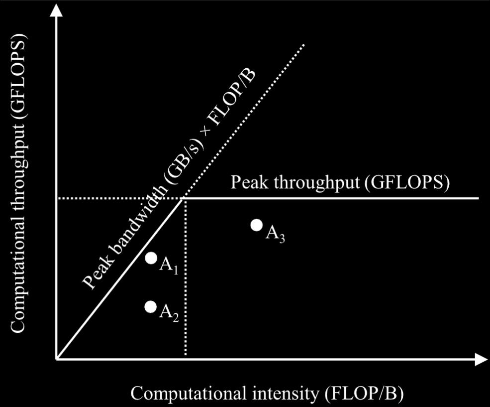

## 5.1 Memory Bandwidth as a Performance Limiter

- The two most common referenced limits in hardware resources are the **peak computational throughput** and the **peak memory bandwidth**.

- For example, the H100 has a peak computational throughput of 66.9 terra floating-point operation per second (TFLOPS).
	- The hardware will typically have different limits for different datatypes, such as 32-bit integers, 64-bit integers, double-precision gloating point values, etc.
- It also has a peak global memory bandwidth of 3.35 terra bytes per second (TB/s).
	- The hardware typically has different limits for different memory structures.

- To determine if a kernel is compute-bound or memory-bound, the ratio of floating-point operation it performs to the bytes it accesses from global memory (FLOP/B) can be used.
	- This ratio is called the **compute-to-global-memory-access ratio**.
	- This ratio is also referred to as **arithmetic intensity** or **computational intensity** in the literature.
- Compute-bound kernels tend to have a high **compute-to-global-memory-access ratio**.
	- They perform many operations relative to the amount of memory that they access.
- Memory-bound kernels tend to have a small ratio, performing few operations relative to the amount of memory that they access.

- The threshold that separates memory-bound kernels from compute-bound kernels depends on the hardware and can be found by taking the peak computational throughput to the peak memory bandwidth.
	- So the H100 has a threshold of (66.9 TFLOPS) / (3.35 TB/s) = 20.0 FLOP/B.
	- So in other words, kernels whose **compute-to-memory-access ratio** is higher than 20.0 FLOP/B are likely to be compute-bound on the H100.

- The **roofline model** is a convenient way to analyse whether a kernel is compute-bound or memory-bound and how well it performs relative to the hardware's peak.

> On the x-axis, we have arithmetic or computational intensity measured in FLOP/B. It reflects the amount of work done by an application for every byte of data loaded. On the y-axis, we have computational throughput measured in GFLOPS. The two lines inside of the plot reflect the hardware limits. The horizontal line is determined by the peak computational throughput (GFLOPS) that the hardware can sustain. The line with a positive slope starting from the origin is determined by the peak memory bandwidth that the hardware can sustain. The point of intersection between these two lines represents the computational intensity threshold at which applications transition from being memory-bound to being compute bound. Applications with lower computational intensity are memory-bound and cannot achieve peak computational throughput because they are limited by memory bandwidth. Within this regime, increasing an application’s computational intensity elevates its potential computational throughput, as reflected by the position slope of the hardware limit line. Once an application’s computational intensity increases beyond the threshold, it becomes compute-bound and is no longer limited by the peak memory bandwidth but by the peak computational throughput.
> A point in the plot represents an application with its computational intensity on the x-axis and the computational throughput it achieves on the y-axis. Of course, the points will be under the two lines because they cannot achieve higher throughput than the hardware peak. The position of a point relative to the two lines tells us about an applications efficiency. Points close to the two lines indicate that an application is using memory bandwidth or compute units efficiently, whereas applications far below the lines indicate inefficient use of resources.

[[Programming Massively Parallel Processors 5th Edition.pdf#page=125&selection=100,0,663,9|Programming Massively Parallel Processors 5th Edition, page 95]]

- If a program accesses memory at 3TB/s and the hardware's peak memory bandwith is 3.35 TB/s, then 90% of the memory bandwidth was used.
- This kind of analysis is referred to as the **speed-of-light analysis**.
	- The kernel is said to to have executed at 90% of the speed of light.
	- The speed is limited by the hardware.

