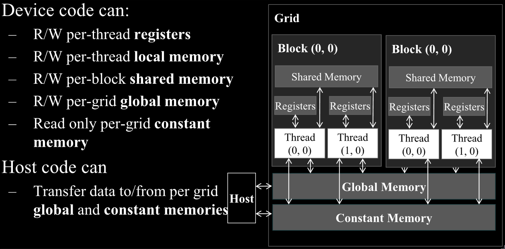

## 5.1 Memory Bandwidth as a Performance Limiter

- The two most common referenced limits in hardware resources are the **peak computational throughput** and the **peak memory bandwidth**.

- For example, the H100 has a peak computational throughput of 66.9 terra floating-point operation per second (TFLOPS).
	- The hardware will typically have different limits for different datatypes, such as 32-bit integers, 64-bit integers, double-precision gloating point values, etc.
- It also has a peak global memory bandwidth of 3.35 terra bytes per second (TB/s).
	- The hardware typically has different limits for different memory structures.

- To determine if a kernel is compute-bound or memory-bound, the ratio of floating-point operation it performs to the bytes it accesses from global memory (FLOP/B) can be used.
	- This ratio is called the **compute-to-global-memory-access ratio**.
	- This ratio is also referred to as **arithmetic intensity** or **computational intensity** in the literature.
- Compute-bound kernels tend to have a high **compute-to-global-memory-access ratio**.
	- They perform many operations relative to the amount of memory that they access.
- Memory-bound kernels tend to have a small ratio, performing few operations relative to the amount of memory that they access.

- The threshold that separates memory-bound kernels from compute-bound kernels depends on the hardware and can be found by taking the peak computational throughput to the peak memory bandwidth.
	- So the H100 has a threshold of (66.9 TFLOPS) / (3.35 TB/s) = 20.0 FLOP/B.
	- So in other words, kernels whose **compute-to-memory-access ratio** is higher than 20.0 FLOP/B are likely to be compute-bound on the H100.

- The **roofline model** is a convenient way to analyse whether a kernel is compute-bound or memory-bound and how well it performs relative to the hardware's peak.

> On the x-axis, we have arithmetic or computational intensity measured in FLOP/B. It reflects the amount of work done by an application for every byte of data loaded. On the y-axis, we have computational throughput measured in GFLOPS. The two lines inside of the plot reflect the hardware limits. The horizontal line is determined by the peak computational throughput (GFLOPS) that the hardware can sustain. The line with a positive slope starting from the origin is determined by the peak memory bandwidth that the hardware can sustain. The point of intersection between these two lines represents the computational intensity threshold at which applications transition from being memory-bound to being compute bound. Applications with lower computational intensity are memory-bound and cannot achieve peak computational throughput because they are limited by memory bandwidth. Within this regime, increasing an application’s computational intensity elevates its potential computational throughput, as reflected by the position slope of the hardware limit line. Once an application’s computational intensity increases beyond the threshold, it becomes compute-bound and is no longer limited by the peak memory bandwidth but by the peak computational throughput.
> A point in the plot represents an application with its computational intensity on the x-axis and the computational throughput it achieves on the y-axis. Of course, the points will be under the two lines because they cannot achieve higher throughput than the hardware peak. The position of a point relative to the two lines tells us about an applications efficiency. Points close to the two lines indicate that an application is using memory bandwidth or compute units efficiently, whereas applications far below the lines indicate inefficient use of resources.

[[Programming Massively Parallel Processors 5th Edition.pdf#page=125&selection=100,0,663,9|Programming Massively Parallel Processors 5th Edition, page 95]]

- If a program accesses memory at 3TB/s and the hardware's peak memory bandwith is 3.35 TB/s, then 90% of the memory bandwidth was used.
- This kind of analysis is referred to as the **speed-of-light analysis**.
	- The kernel is said to to have executed at 90% of the speed of light.
	- The speed is limited by the hardware.

- This is an incomplete overflow of the CUDA device memory model.
- An important type of CUDA memory not covered is the texture memory, since its use is not covered by this book.
## 5.2 CUDA Memory Types

- Global memory can also be written and read by the device, whereas the constant memory supports short-latency, high bandwidth read-only access by the device

- **Local memory** can be read and written.
	- CUDA variables declared into the local memory are actually placed into global memory and have similar access latency but are not shred across threads.
- Each thread has its own section of global memory that it uses as its own private local memory where is places its local variables and data that cannot be allocated in registers.
	- Such variables and data include statically allocated arrays, spilled registers and other elements of the thread's call stack.
	- Statically allocated arrays that have have a small and constant size are accessed only with constant indices can be allocated into registers.
		- See chapter 6 for details.

- **Registers** are one type of on-chip memory.
	- Variables that reside in registers can be accessed at very high speed in a highly parallel manner.
	- Registers are allocated to individual threads.
		- Each thread can only see its own registers.
	- A kernel function typically uses registers to hold frequently accessed variables that are private to each thread.

> CPU vs. GPU Register Architecture
> 
> The different design objectives across the CPUs and GPUs result in different register architectures. As we saw in Chapter 4, when CPUs context switch between different threads, they save the registers of the outgoing thread to memory and restore the registers of the incoming thread from memory. In contrast, GPUs achieve zero-overhead scheduling by keeping the registers of all the threads that are scheduled on the processing block in the processing block’s register file. This way, switching between warps of threads is instantaneous because the registers of the incoming threads are already in the register file. Consequently, GPU register files need to be substantially larger than CPU register files. We also saw in Chapter 4 that GPUs support dynamic resource partitioning where an SM may provision few registers per thread and execute a large number of threads, or it my provision more registers per thread and execute fewer threads. For this reason, GPU register files need to be designed to support such dynamic partitioning of registers. In contrast, the CPU register architecture dedicates a fixed set of registers per thread regardless of the thread’s actual demand for registers.

[[Programming Massively Parallel Processors 5th Edition.pdf#page=129&selection=10,0,413,10|Programming Massively Parallel Processors 5th Edition, page 101]]

- **Shared memory** is another type of on-chip memory.
	- Data that resides in shared memory can also be accessed at a high speed relative to global memory.
		- Though not as fast as registers.
	- It is allocated to thread blocks.
	- All threads in a block can access shared-memory variables for the block.
	- Shard memory is an efficient means for threads in the same block to cooperate.
		- It does this by sharing their input data and intermediate results.

- Typically, the aggregated access bandwidth of all the register files across the SMs is at least two orders of magnitude higher than that of global memory.
- Furthermore, whenever a variable is stored in a register, its accesses no longer consume off-chip memory bandwidth.

- A subtler point is that an access to a register involves fewer instructions than an access to global memory.
- For example, a floating-point addition instruction might be of the form: `fadd r1, r2, r3`.
	- `r2` and `r3` are the register numbers that specifies the location in the register files where the input operand values can be found.
- Meanwhile, if an operand value is in global memory, the processor needs to perform a memory load operation to make the operand value available to the ALU.
	- `load r2, r4, offset`
	- `fadd r1, r2, r3`

 - Finally, the energy consumed for accessing a value from the register file is at least an order of magnitude lower than for accessing a value from global memory.

- The number of registers available to each thread is quite limited in today's GPUs.
- The occupancy achieved for an application can be reduced if the register usage exceeds the limit for full-occupancy scenarios.
	- Therefore, there is a need to avoid oversubscribing to this limited resource whenever possible.

- When the processor accesses data that resides in the shared memory, it needs to perform a memory load operation, just like global memory.
- However, because shared memory resides on chip, it can be accessed with much lower latency and higher throughput than global memory.

- Starting with Hopper architecture, threads in the same thread block cluster can access the shared memory of any block in the cluster.
	 - This feature is referred to as **distributed shared memory**.
 - Distributed shared memory expands the scope of threads that can collaborate without accessing global memory.
	 - It also gives them access to a larger collective pool of fast memory.

| Variable Declaration                  | Memory   | Scope  | Lifetime    |
| ------------------------------------- | -------- | ------ | ----------- |
| Automatic variables other than arrays | register | thread | grid        |
| Automatic array variables             | local    | thread | grid        |
| `__device____shared__ int SharedVar`  | shared   | block  | grid        |
| `__device__ int GlobalVar`            | global   | grid   | application |
| `__device____constant__ int ConstVar` | constant | grid   | application |

- The scope of a shared memory variable is within a thread block.
- A private version of that variable is created for and used by each block during kernel execution.

- Constant variables are often used to provide input values to kernel functions.
- The values of the constant variables cannot be changed by the kernel function code.
- They are stored in global memory but are cached for efficient access.
- With appropriate access patterns, accessing constantly memory is extremely fast and parallel.
- Currently the total size of constant variables in an application is limited at 65,536 bytes.

- Global variables are often used to pass information from one kernel invocation to another kernel invocation, without providing the information as a kernel parameter.
- In general, global variables are considered bad style and should be used sparingly because they can cause bug and negatively impact the code's modularity.
