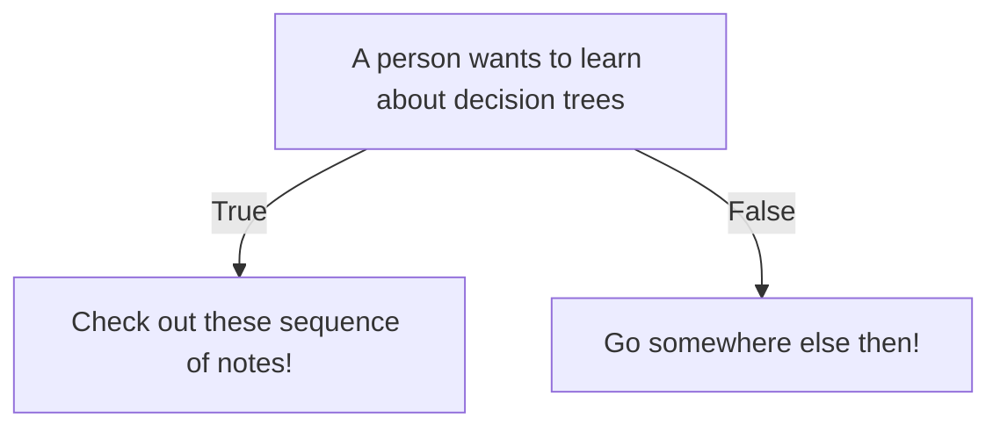

Zettelcasten Index: 20230227115732-a
Sequence: [[20230227115732-a1]]
Status: #idea
Zettelcasten Tags: [[Data Science]], [[Machine Learning]], [[Artificial Intelligence]], [[20230227115732]]

---

The very top of the tree is called the root node. The internal nodes and branches are in-between the top and bottom of the tree. Branches have arrows pointing to nodes **and** arrows pointing away from them. Leaves have arrows pointing to them but no arrows pointing away.

## References
- [[StatQuest with Josh Starmer#Decision Trees]]
