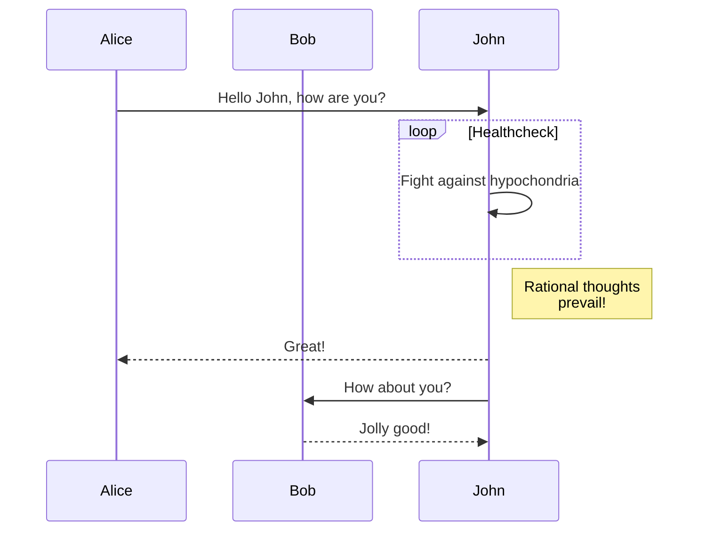

Zettelcasten Index: 20230227123735-b
Sequence:
Status: #idea
Zettelcasten Tags: [[Learning]], [[Diagrams]], [[20230227123735|20230227123735]], [[Sequence Diagram]]

---

```
sequenceDiagram
    participant Alice
    participant Bob
    Alice->>John: Hello John, how are you?
    loop Healthcheck
        John->>John: Fight against hypochondria
    end
    Note right of John: Rational thoughts <br/>prevail!
    John-->>Alice: Great!
    John->>Bob: How about you?
    Bob-->>John: Jolly good!
```



## References
- [[references/Mermaid|Mermaid#Sequence Diagrams]]