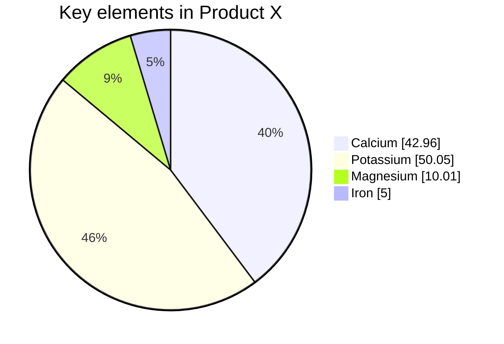

Zettelcasten Index: 20230227123735-h
Sequence:
Status: #idea
Zettelcasten Tags: [[Learning]], [[Diagrams]], [[Mermaid]], [[Pie Chart]]

---

-   Start with `pie` keyword to begin the diagram
    -   `showData` to render the actual data values after the legend text. This is **_OPTIONAL_**
-   Followed by `title` keyword and its value in string to give a title to the pie-chart. This is **_OPTIONAL_**
-   Followed by dataSet. Pie slices will be ordered clockwise in the same order as the labels.
    -   `label` for a section in the pie diagram within `" "` quotes.
    -   Followed by `:` colon as separator
    -   Followed by `positive numeric value` (supported up to two decimal places)

```
pie showData
    title Key elements in Product X
    "Calcium" : 42.96
    "Potassium" : 50.05
    "Magnesium" : 10.01
    "Iron" :  5
```



## References
- [[references/Mermaid|Mermaid#Pie Charts]]