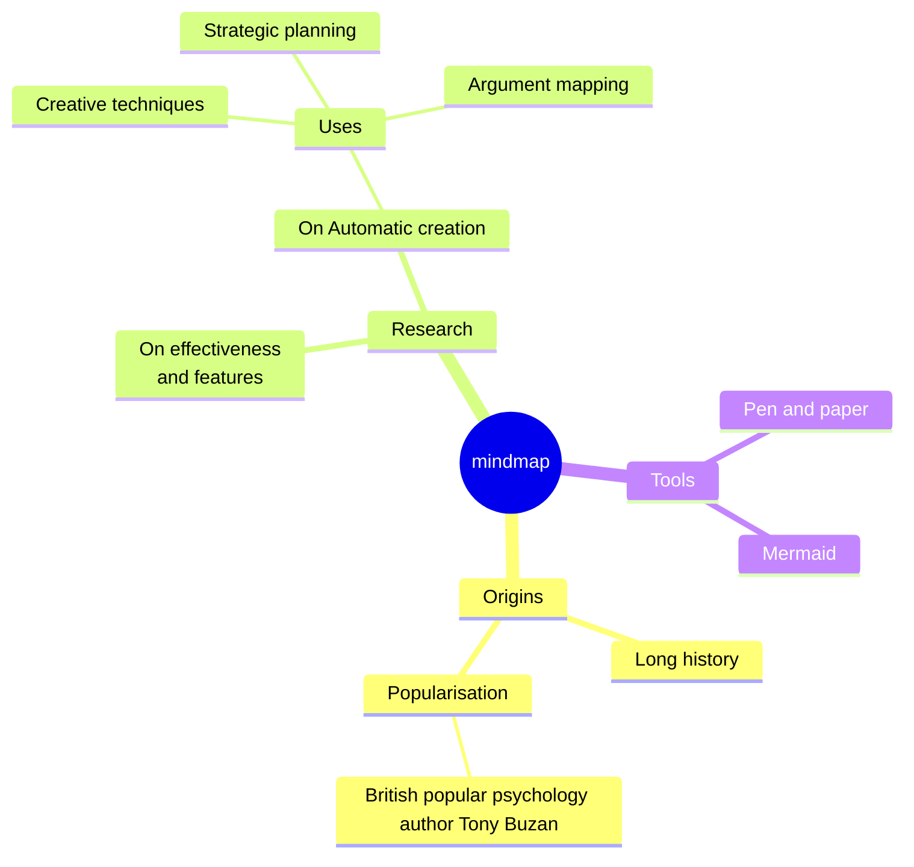

Zettelcasten Index: 20230227123735-j
Sequence:
Status: #idea
Zettelcasten Tags: [[Learning]], [[Diagrams]], [[Mermaid]], [[Mindmap]]

---

```
mindmap
  root((mindmap))
    Origins
      Long history
      ::icon(fa fa-book)
      Popularisation
        British popular psychology author Tony Buzan
    Research
      On effectiveness<br/>and features
      On Automatic creation
        Uses
            Creative techniques
            Strategic planning
            Argument mapping
    Tools
      Pen and paper
      Mermaid
```



## References
- [[references/Mermaid|Mermaid#Mindmap]]