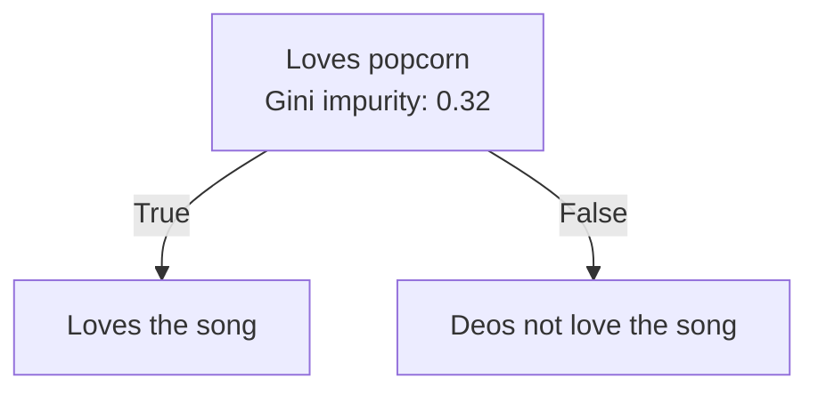
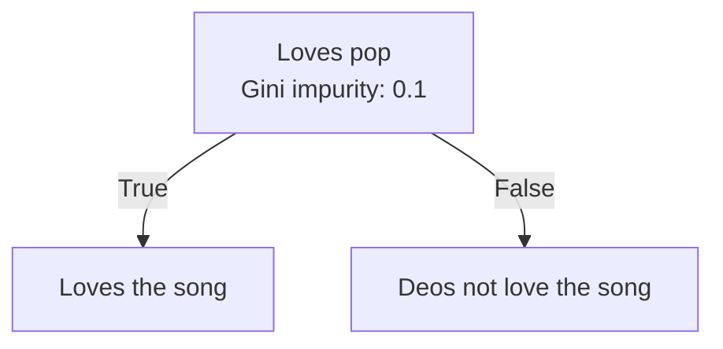
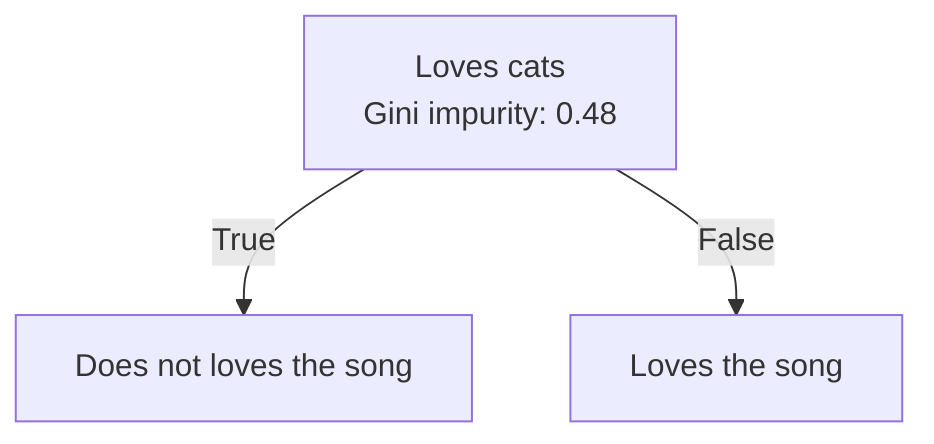

Zettelcasten Index: 20230227115732-a1
Sequence: [[Building the Root Node of a Decision Tree With Numerical Features]]
Status: #idea
Zettelcasten Tags: [[Data Science]], [[Machine Learning]], [[Artificial Intelligence]], [[Decision Trees]], [[Gini Impurity of Decision Tree Leaves]], [[Decision Tree Gini Impurity]]

---

The root node of a [[Decision Trees|decision tree]] is built via calculating the [[Decision Tree Gini Impurity|gini impurity]] of each root tree for each feature. The the feature that generates the lowest gini impurity is then chosen as the root.

## References
- [[StatQuest with Josh Starmer#Decision Trees]]