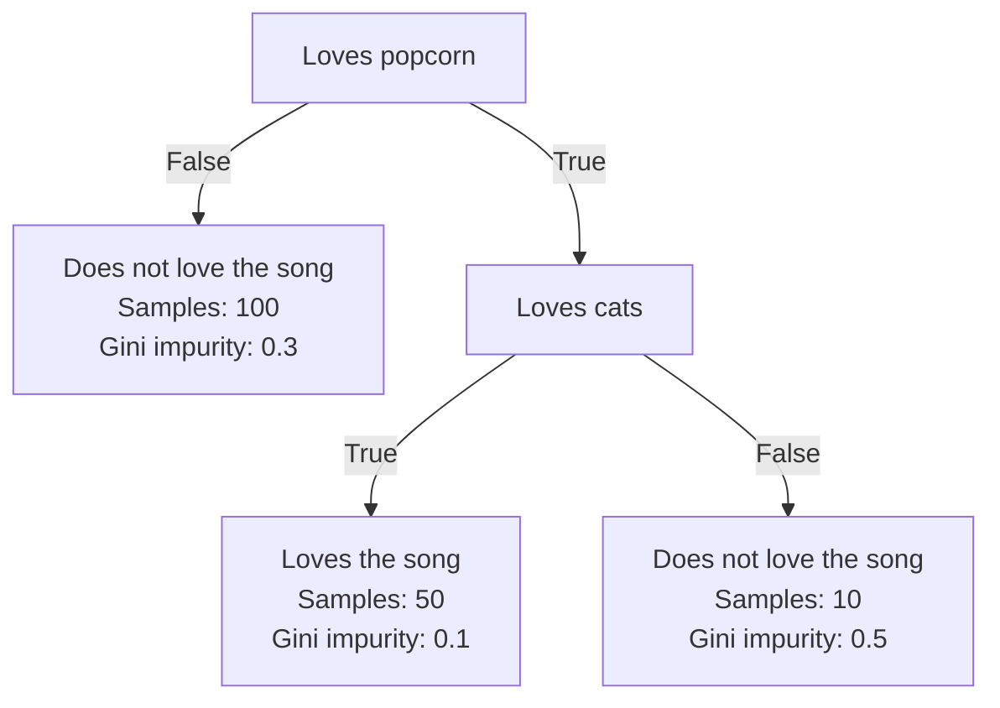

Zettelcasten Index: 20230227115732-c2
Sequence:
Status: #idea
Katex: true
Zettelcasten Tags: [[Data Science]], [[Machine Learning]], [[Artificial Intelligence]], [[Decision Trees]], [[Gini Impurity]], [[Decision Trees Branches And Nodes]], [[Gini Impurity of Decision Tree Leaves]]

---

The total [[Decision Tree Gini Impurity|gini impurity]] of a tree is the weighted average of gini impurities (weighted on samples) of the leaves. These leaves are weighted as they may not represent the same number of samples.

Example:

$\text{total gini impurity} = \frac{100}{160}\times0.3 + \frac{50}{160}\times0.1 + \frac{10}{160}\times0.5 = 0.25$

## References
- [[StatQuest with Josh Starmer#Decision Trees]]