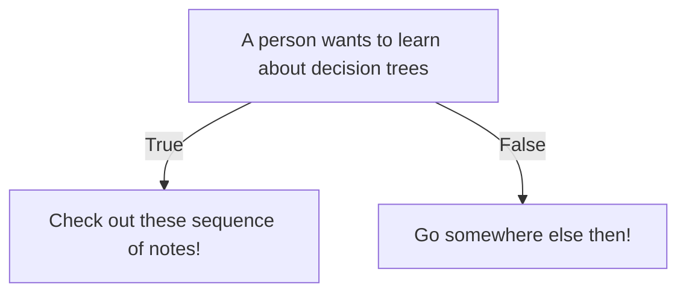

Zettelcasten Index: 20230227115732
Sequence: [[Decision Trees Branches And Nodes]], [[Gini Impurity of Decision Tree Leaves]], [[Splitting a Leaf of a Decision Tree]]
Status: #idea
Zettelcasten Tags: [[Data Science]], [[Machine Learning]], [[Artificial Intelligence]]

---

A decision tree is a tree of statements and with decisions based on whether or not the statement is **true** or **false**.

If the statement is **true** then you go left and *vice versa*. A question on a feature can be asked multiple times. The same goes for final classifications.

## References
- [[StatQuest with Josh Starmer#Decision Trees]]