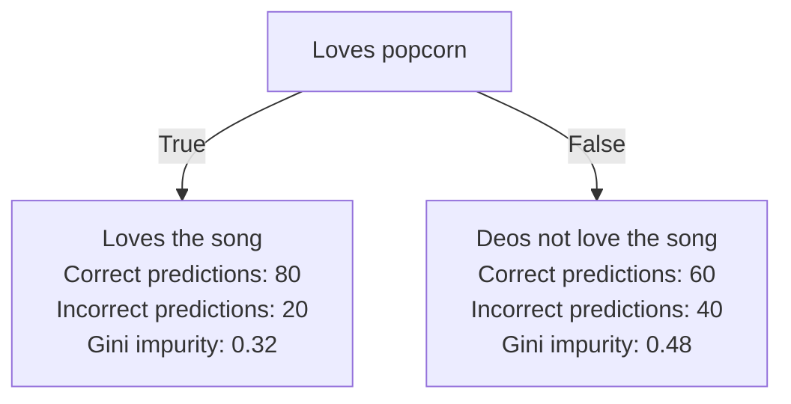

Zettelcasten Index: 20230227115732-b
Sequence: [[Max and Min Gini Impurity of Decision Tree Leaves]], [[Decision Tree Gini Impurity]]
Status: #idea
Katex: true
Zettelcasten Tags: [[Data Science]], [[Machine Learning]], [[Artificial Intelligence]], [[Decision Trees]], [[Gini Impurity]], [[Decision Trees Branches And Nodes]]

---

$$\text{gini impurity} = 1 - prob_{correct}^2 - prob_{incorrect}^2$$
The gini impurity indicates the likelihood of new data being misclassified, based off the distribution of labels of the training dataset.

Example:

## References
- [[StatQuest with Josh Starmer#Decision Trees]]