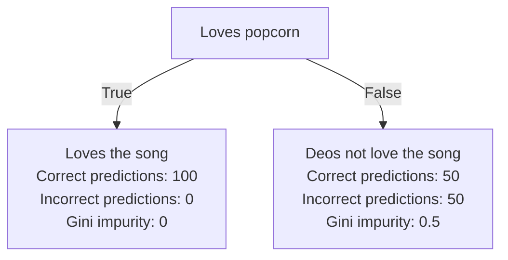

Zettelcasten Index: 20230227115732-c1
Sequence:
Status: #idea
Zettelcasten Tags: [[Data Science]], [[Machine Learning]], [[Artificial Intelligence]], [[Decision Trees]], [[Gini Impurity]], [[Gini Impurity of Decision Tree Leaves]]

---

The maximum [[Gini Impurity of Decision Tree Leaves|gini impurity]] of a decision tree leaf occurs when a leaf is correct only 50% of the time. This means that the maximum gini impurity is `0.5`. Conversely, the minimum gini impurity is `0`. This happens when the leaf is correct 100% of the time.

Example:

## References