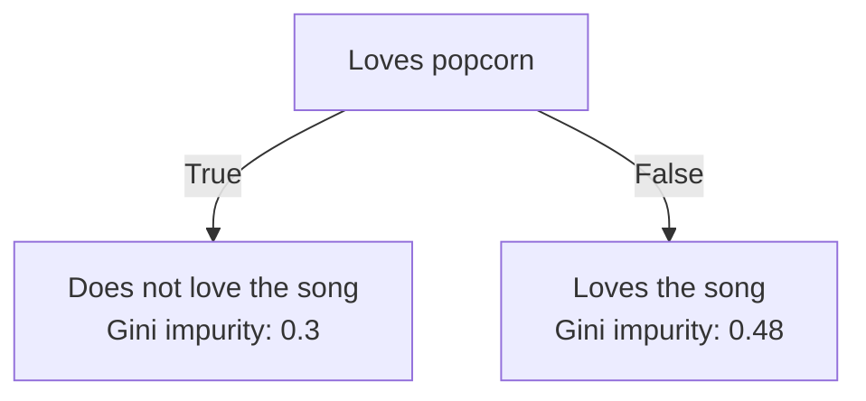
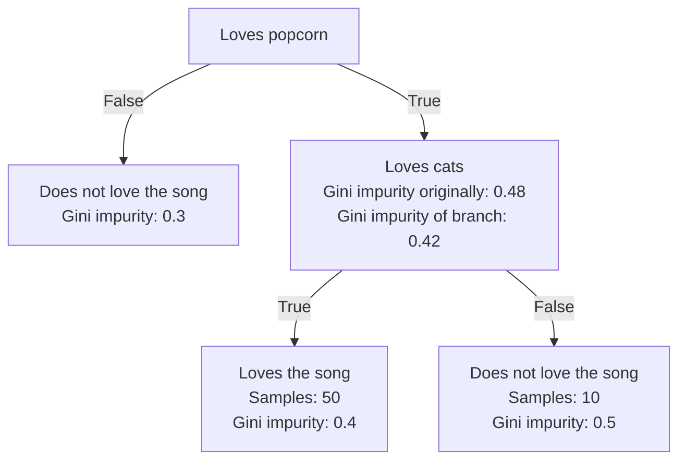

Zettelcasten Index: 20230227115732-c
Sequence: [[Preventing Decision Tree Overfitting]]
Status: #idea
Zettelcasten Tags: [[Data Science]], [[Machine Learning]], [[Artificial Intelligence]], [[Decision Trees]], [[Decision Trees Branches And Nodes]], [[Gini Impurity of Decision Tree Leaves]]

---

A leaf can be split by comparing features and if they reduce the gini impurity of a [[Decision Trees Branches And Nodes|branch]]. The feature generates the lowest gini impurity for that branch is chosen.

Example:

Checking if splitting the right node via `loves cats` would reduce the branch gini impurity:

The node would be split into a branch as the gini impurity of the branch is lower.

## References
- [[StatQuest with Josh Starmer#Decision Trees]]
